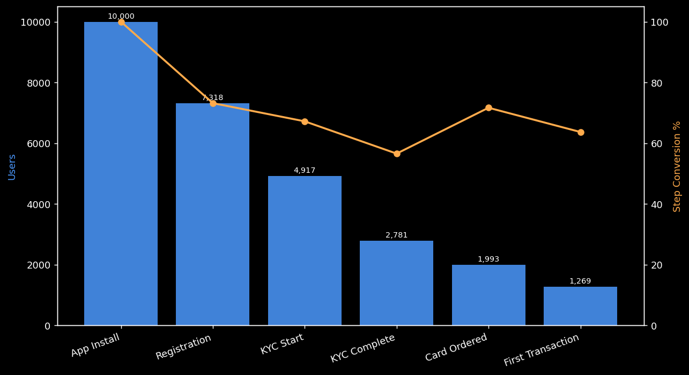
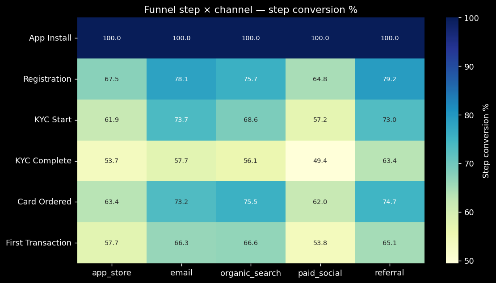
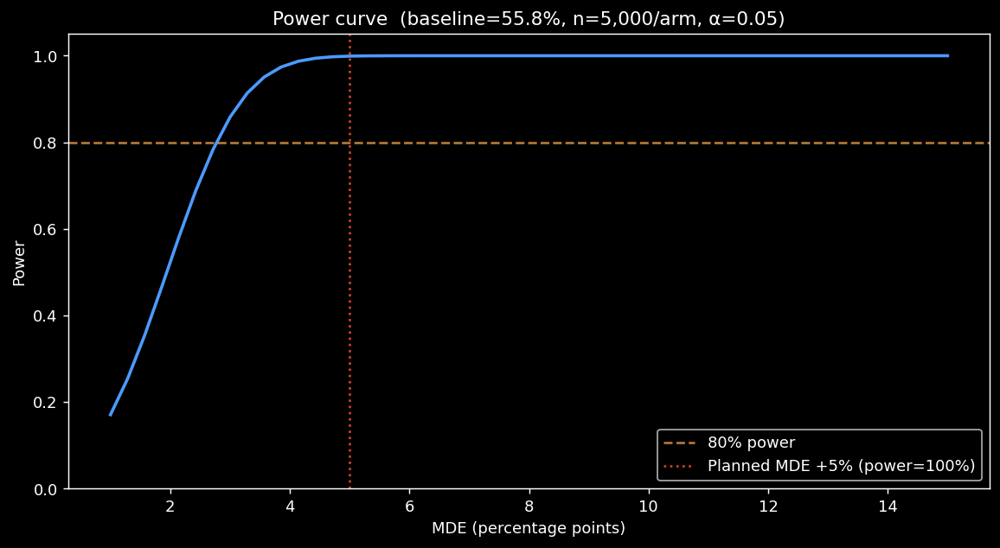
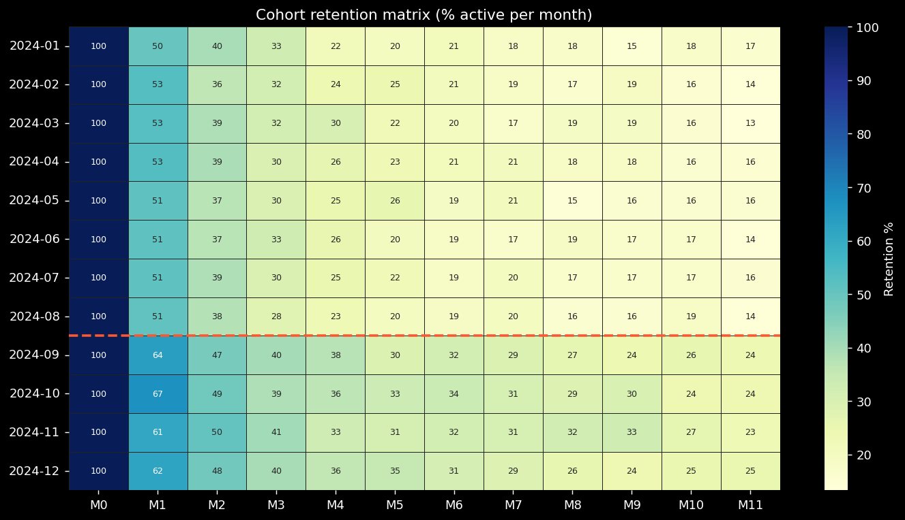
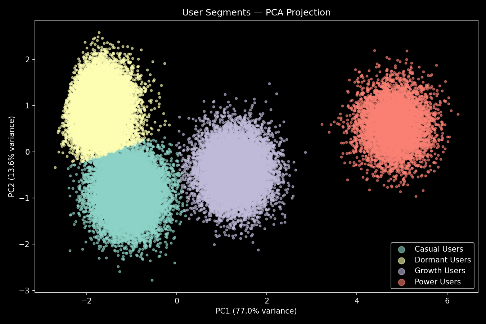
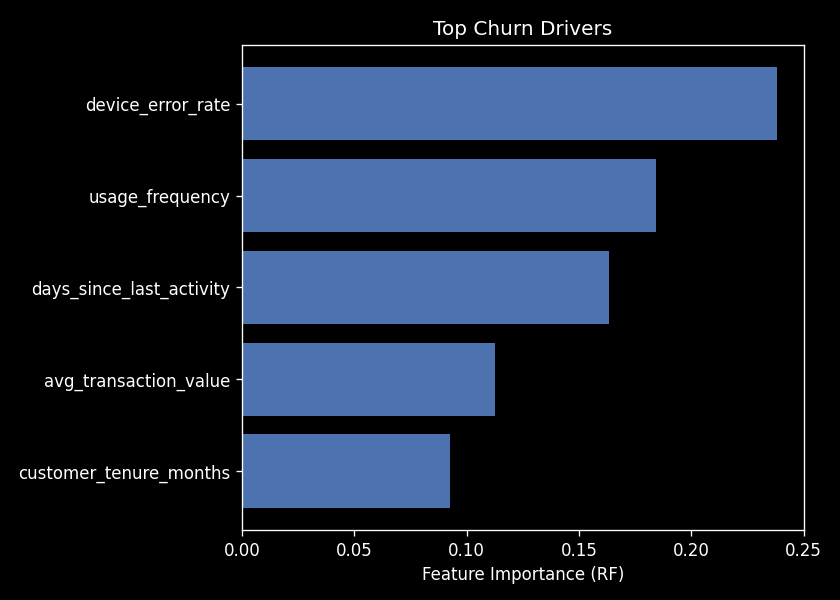
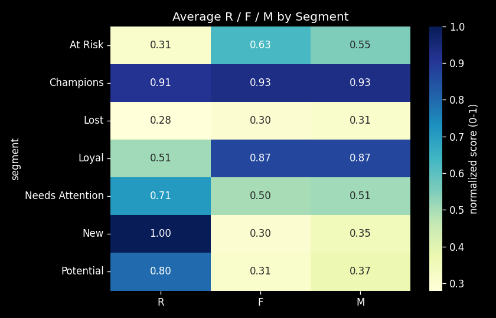

# 🏦 Volta Neobank — Product Analytics Portfolio

> **9 projects** | Funnel → A/B → Retention → Segmentation → Churn → RFM → CLV → Attribution → Anomaly | Fintech / Digital Banking

An end-to-end product analytics narrative for a fictional neobank ("Volta"). The
core four projects pick up where the previous one left off, demonstrating the
full data-driven product loop: **discover → validate → measure → optimize**.
Five further projects extend the portfolio across ML and advanced analytics.

All data is synthetic, generated by reproducible seeded scripts included in the repo.

---

## 📌 The Narrative

| # | Project | Question | Key Output |
|---|---------|----------|------------|
| 1 | **Funnel Analysis** | Where do users drop off in onboarding? | KYC is the critical bottleneck |
| 2 | **A/B Testing** | Does a KYC progress bar fix it? | +6.24pp lift, p<0.0001 → ship |
| 3 | **Retention & Cohort** | Did the fix improve long-term retention? | +9.2pp M3 retention, +€227K/yr LTV |
| 4 | **User Segmentation** | Who are the users, how to monetize? | 4 segments, per-segment strategy |
| 5 | **Churn Prediction** | Which users will churn, and why? | RF +0.03 ROC-AUC over LR; top driver = inactivity |
| 6 | **RFM Analysis** | How do customers differ by value? | 6 lifecycle segments |
| 7 | **CLV Modeling** | What is each segment worth? | 3 methods: historical / retention-curve / Gamma-Gamma |
| 8 | **Marketing Attribution** | Which channels truly drive revenue? | First/last/linear/Shapley — referral leads |
| 9 | **Anomaly Detection** | Which transactions are suspicious? | Z-score/IQR/Isolation Forest, scored vs ground truth |

---

## 📊 Key Findings

### Project 1 — Funnel

| Finding | Metric | Impact |
|---------|--------|--------|
| **Registration** = biggest **absolute** drop | 2,682 users lost (73.2% step conv) | ~€228K lost per 10K installs |
| **KYC Complete** = biggest **relative** drop | 56.6% step conv (43.4% drop) | Critical bottleneck |
| Referral converts 11.7pp better than paid social | p<0.05 | Lower CAC, higher LTV |
| iOS outperforms Android at every step | 13.6% vs 11.7% end-to-end | Compounding activation gap |
| 45+ users drop at KYC disproportionately | Document upload friction | Untapped older demographic |

> **Metric note:** the funnel has two "biggest drop" answers depending on the lens.
> Registration loses the most users in absolute terms; KYC Complete has the lowest
> step-conversion rate (largest relative drop). The analysis reports both explicitly.

### Project 2 — A/B Test (KYC progress bar)

- Control 55.8% → Treatment 62.1% (**+6.24pp**, Z=6.35, p<0.0001)
- 95% CI: [+4.26%, +8.16%] — exceeds the +5pp MDE
- No SRM (p=1.00); covariate balance confirmed
- Segment: 9/11 naive-significant, 4/11 after Bonferroni correction
- **Ship-gate:** p<0.05 AND lift≥MDE AND no SRM → ✅ ship
- Business impact: +€716K/yr (48× ROI on €15K dev cost)
- Methodology: CUPED (control-only θ), AA-test (type-I = 0.050), sensitivity at MDE (99.9%)

### Project 3 — Retention & Cohort

- M1 retention: +10pp step-change after the Sep 2024 KYC fix
- M3 retention: +9.2pp (Welch t-test + Cohen's d; small-n caveat noted)
- **Premium vs Free LTV = 4.3×** — decomposed into ARPU (2.66×) × retention (1.62×)
  (the prior version reused the Free curve for Premium, collapsing the gap to an
  ARPU-only artifact; Premium now has its own retention curve, M6 ≈ 0.55 vs 0.21)
- Fleet impact: +€227K/yr incremental LTV from the KYC fix

### Project 4 — User Segmentation

- **K=4 selected from data** (marginal-gain elbow rule: last K with reduction ≥ 50%
  of the best reduction; validated by silhouette plateau K=2–4 then collapse at K=5)
- Segment sizes derived from data: Power 12% / Growth 24% / Casual 32% / Dormant 32%
  (the prior version hardcoded 12/24/43/43 = 122%, summed past 100%)
- Lorenz concentration: 12% of users → 41% of revenue; 68% → 92%
- Monetization scenarios: +€26K/mo (€310K/yr) from segment migration
- 4 recommended A/B tests to validate the strategy

### Projects 5–9 — Extended Portfolio

| Project | Method | Key Output |
|---------|--------|------------|
| **Churn** | Logistic Regression vs Random Forest, ROC-AUC + feature importance | RF +0.03 AUC; #1 driver = days since last activity |
| **RFM** | R/F/M 1-5 scoring → lifecycle tiers | 6 segments (Champions→Lost) with avg R/F/M heatmap |
| **CLV** | Historical / retention-curve / Gamma-Gamma | Consistent Power > Growth > Casual > Dormant across methods |
| **Attribution** | First-touch, last-touch, linear, Shapley | Shapley (data-driven) reallocates budget; referral leads |
| **Anomaly** | Z-score, IQR, Isolation Forest | IF best F1 — catches amount, late-night & velocity anomalies |

---

## 📊 Visualizations

All charts regenerate into `outputs/` when the scripts run.

**Onboarding funnel** (Project 1)



**A/B test power curve** (Project 2)


**Cohort retention heatmap** (Project 3)


**Segmentation** (Project 4)


**Churn drivers** (Project 5)


**RFM segments** (Project 6)


---

## 🛠️ Tech Stack

```
Python ≥3.10    pandas · numpy · matplotlib · seaborn · scipy · scikit-learn
uv              package manager (pyproject.toml + uv.lock)
ruff            lint + format (configured in pyproject.toml)
mypy            type checking (new code; legacy scripts exempted)
pytest          test suite (tests/) + pytest-cov (~97% on active code)
pre-commit      ruff + pytest hooks before each commit
nbformat/nbconvert   executed presentation notebooks
```

---

## 📁 Project Structure

```
volta-banking/
├── volta_funnel_analysis.py        Project 1 — funnel + Chi-square
├── volta_ab_testing.py              Project 2 — A/B test + CUPED + AA-test
├── volta_retention_analysis.py      Project 3 — cohort + LTV (Free vs Premium curves)
├── volta_segmentation.py           Project 4 — K-means + PCA + monetization
├── volta_churn_prediction.py       Project 5 — LR vs RF churn, ROC-AUC + importance
├── volta_rfm_analysis.py           Project 6 — R/F/M scoring + lifecycle segments
├── volta_clv_modeling.py           Project 7 — CLV: historical/retention/Gamma-Gamma
├── volta_attribution.py            Project 8 — first/last/linear/Shapley attribution
├── volta_anomaly_detection.py      Project 9 — Z-score/IQR/Isolation Forest
├── generate_*.py                     seeded generators → data/*.csv (one per project)
├── build_notebooks.py               → executed notebooks/ for the core four projects
├── tests/                           pytest suite (+ smoke tests run every main())
├── utils/
│   ├── common.py                    shared setup, banners, CONSTANTS, data_path(), OUTPUT_DIR
│   ├── report_generator.py          Excel report generation (openpyxl)
│   └── pdf_processor.py             PDF table extraction (pdfplumber, pypdf)
├── data/                            all synthetic CSVs (committed)
├── outputs/                         generated PNG visualizations (committed)
├── notebooks/                       executed .ipynb for Projects 1–4
├── presentations/                   PRD docs, slide decks, executive summary HTML
├── pyproject.toml                   deps + ruff/mypy/pytest/cov config
├── uv.lock
├── Makefile                         task runner: make data|test|lint|format|type|notebooks|all
└── .gitignore
```

---

## 🚀 Quickstart

```bash
# 1. Install dependencies (dev group includes ruff + pytest)
uv sync --all-groups

# 2. Generate the synthetic datasets (seeded — reproducible)
make data
# or: uv run python generate_ab_data.py && uv run python generate_retention_data.py \
#     && uv run python generate_segmentation_data.py && uv run python generate_funnel_data.py

# 3. Run the four analyses in order
uv run python volta_funnel_analysis.py
uv run python volta_ab_testing.py
uv run python volta_retention_analysis.py
uv run python volta_segmentation.py

# 4. Lint / format / type
uv run ruff check .
uv run ruff format .
uv run mypy

# 5. Run the test suite (with coverage)
uv run pytest
```

> All four projects read CSVs produced by the generators into `data/` (the funnel
> CSV is committed there too). PNG visualizations land in `outputs/`. Re-run
> `make data` anytime — the generators are seeded and deterministic.

---

## 📐 Methodology

- **Funnel** — step conversion, absolute/relative drop-off, Chi-square channel test,
  Wilson confidence intervals on step conversion rates
- **A/B testing** — sample-size calc, SRM check, bootstrap CI, Bonferroni/Holm/BH
  multiple-testing correction, AA-test under H₀, CUPED variance reduction
  (control-only θ, % variance reduction reported), sensitivity at MDE
  (not deprecated post-hoc power)
- **Retention** — cohort curves, pre/post Welch t-test + Cohen's d, bootstrap CIs on
  M1/M3/M6 retention, plan-specific LTV curves with ARPU × retention decomposition
- **Segmentation** — StandardScaler + KMeans, data-driven K (marginal-gain elbow,
  silhouette validation), per-cluster silhouette, PCA projection, Lorenz
  concentration, churn sensitivity

All scripts use a shared `utils/common.py` (`setup()`, `print_section()`,
`CONSTANTS`, `data_path()`) and follow a `functions + main()` structure —
importing a module does **not** execute the analysis.

---

## 💡 Recommendations (Project 1)

1. **Redesign KYC UX** — progress bar (validated in Project 2), real-time photo guidance
2. **Simplify Registration** — A/B test removing phone-number field
3. **Double down on Referral** — launch referral bonus, reallocate 15% paid-social budget
4. **Android-specific sprint** — QA audit to close the iOS gap
5. **First-transaction nudge** — push + cashback on card activation

---

*Synthetic data · educational portfolio · seeded generators for reproducibility.*
