# 🏦 Volta Neobank — Product Analytics Portfolio

[](https://github.com/NikitaBoyarkin/volta-banking/actions/workflows/ci.yml)


[](LICENSE)

**▶ [Open the analytics board](docs/board/volta_board.html)** — zero-install, opens in your browser (inline SVG, no JS, no CDN) · **[Active PRD (v2)](docs/prd-v2.md)** · [Run it locally](#-quickstart)


> **21 projects** | Funnel → A/B → Retention → Segmentation → Churn → RFM → CLV → Attribution → Anomaly → Spend → Support & Churn → NPS → JTBD×Cohorts → Unit Economics → Premium Upsell → 45+ KYC Deep-Dive → Referral Segments → Assisted CAC vs LTV → FX Sourcing → Segment Premium Offers → Anchor Launch CAC | Fintech / Digital Banking

Twenty-one projects follow one product from first install to retention: an
onboarding funnel that surfaces the KYC bottleneck, an A/B test, cohort
retention, and a **difference-in-differences causal test** of whether the fix
actually caused the lift — then churn, segmentation, a Market & Jobs (JTBD)
layer, and a **RAT v2 validation layer** that prices the audit's own
recommendations. Every headline number is reproducible from the seeded scripts in the repo.

All data is synthetic, generated by reproducible seeded scripts included in the repo.

---

## 📌 The Narrative

| # | Project | Question | Key Output |
|---|---------|----------|------------|
| 1 | **Funnel Analysis** | Where do users drop off in onboarding? | KYC is the critical bottleneck |
| 2 | **A/B Testing** | Does a KYC progress bar fix it? | +5.72pp lift (≥ +5pp MDE), p<0.0001 → ship |
| 3 | **Retention & Cohort** | Did the fix improve long-term retention? | +9.2pp M3 retention, +€227K/yr LTV |
| 4 | **User Segmentation** | Who are the users, how to monetize? | 4 segments, per-segment strategy |
| 5 | **Churn Prediction** | Which users will churn, and why? | RF +0.03 ROC-AUC over LR; top driver = device errors |
| 6 | **RFM Analysis** | How do customers differ by value? | 6 lifecycle segments |
| 7 | **CLV Modeling** | What is each segment worth? | 3 methods: historical / retention-curve / Gamma-Gamma |
| 8 | **Marketing Attribution** | Which channels truly drive revenue? | First/last/linear/Shapley — referral leads |
| 9 | **Anomaly Detection** | Which transactions are suspicious? | Z-score/IQR/Isolation Forest, scored vs ground truth |
| 10 | **Spend Analysis** | Where does money go, and on what? | Category/channel breakdown, decline rate, monthly trend |
| 11 | **Support & Churn** | Does bad support drive churn? | Churn by tickets, unresolved, CSAT band |
| 12 | **NPS Trends** | Are customers promoters? | Monthly NPS, drivers, promoter mix |
| 13 | **JTBD × Cohorts** | Do job segments match behavioral cohorts? | Dormant = UX friction (Digital Newcomers 45+), not "no job" |
| 14 | **Unit Economics** | Do travelers break the bank at scale? | Travelers lose €/tx; break-even needs FX cost 1.0%→0.55% |
| 15 | **Premium Upsell** | Does the upsell transfer to new segments? | Anchor 17% vs Digital Newcomers 45+ 2% — value prop doesn't land |
| 16 | **45+ KYC Deep-Dive** | Does the KYC fix close 45+? | 45+ lift +1.4pp (ns) vs 35-44 +11.0pp — friction is trust, not UX |
| 17 | **Referral Segments** | Does referral scale to new segments? | Anchor 29.6% vs Digital Newcomers 4.8% — value prop doesn't transfer |
| 18 | **Assisted CAC vs LTV** | Does the 45+ trust track pay for itself? | 45+ LTV/CAC 0.66 (gate ≥3); assisted CAC €120 unrepayable |
| 19 | **FX Sourcing** | Can FX cost be negotiated to break-even? | Gate 0.55% reachable only at SOM scale (~€332M/mo) — cold-start |
| 20 | **Segment Premium Offers** | Do segment-specific offers lift gap conversion? | +3.3pp 45+, +4.2pp family; anchor flat — narrows, doesn't close |
| 21 | **Anchor Launch CAC** | Does the anchor launch P&L survive scaling? | Gate holds to ~70K; at SOM LTV/CAC 1.76× — breaks on paid CAC |

---

## 📋 PRD

- **Active — Portfolio 2.0 (improvement):** [`docs/prd-v2.md`](docs/prd-v2.md) — a bounded reopen: a causal layer that tests the portfolio's own claim, SHAP on churn, a zero-install HTML board, and a polish set. Decision record: [`docs/adr/0001-bounded-reopen-volta-2.0.md`](docs/adr/0001-bounded-reopen-volta-2.0.md).
- **As-is snapshot (v1):** [`docs/prd.md`](docs/prd.md) — 17 requirements (12 analytical domains + Market & Jobs + engineering/platform).
- Vault notes: `Obsidian/Z-core/PRD v2 - Volta Banking.md`, `Obsidian/Z-core/PRD - Volta Banking.md`.

---

## 🎯 Market & Jobs (JTBD)

Product-thinking layer: JTBD-audit of Volta's B2C market — top-5 segments, RAT
risk ranking, and recommendations. Full audit: `Obsidian/Z-core/AJTBD - Volta Full Audit.md`.

### Top-5 B2C segments

| # | Segment | TAM | Value | Profitability | Scale | Score |
|---|---------|-----|-------|---------------|-------|-------|
| 1 | Young professionals 25–34 | High | High | High | High | 9.2 |
| 2 | Digital newcomers 45+ | High | Medium–high | Medium | Medium | 8.1 |
| 3 | Family budgeters 30–45 | High | High | High | High | 7.6 |
| 4 | Premium status-seekers (Power 12%) | Medium | High | Very high | Low | 7.3 |
| 5 | Travelers / nomads | Medium | Very high | **Low** | Medium | 6.4 |

> **v2 re-score (after Projects 13–17):** travelers dropped #3 → #5 (Project 14 —
> negative per-tx margin); Family Budgeters rose (strongest product fit, Dormant
> 15% vs 40%); Premium status rose (41% conversion, 12% of users → 41% of revenue).

### Risks (RAT)

**v1 — all five validated by Projects 13–17 (assumption confirmed true):**

| # | Risk (v1) | Category | Status | Evidence | P | I | Score |
|---|-----------|----------|--------|----------|---|---|-------|
| 1 | Traveler unit economics breaks at scale | unit economics | ✅ validated | Project 14: margin/tx < 0; break-even FX cost 1.0%→0.55% | 5 | 5 | 25 |
| 2 | Premium upsell doesn't transfer to new segments | value | ✅ validated | Project 15: anchor 17% vs 45+ 2% (z=34), chi² p<0.001 | 5 | 4 | 20 |
| 3 | Job segments ≠ behavioral cohorts (Dormant = UX, not job) | market | ✅ validated | Project 13: chi² p<0.001; Dormant 40% in 45+ vs 15% | 5 | 3 | 15 |
| 4 | KYC fix doesn't close 45+ (friction = trust, not UX) | segment | ✅ validated | Project 16: 45+ +1.4pp (p=0.59) vs 35–44 +11.0pp | 5 | 4 | 20 |
| 5 | Referral doesn't scale to new segments | acquisition | ✅ validated | Project 17: anchor 29.6% vs 45+ 4.8% (z=43.3) | 5 | 4 | 20 |

**v2 — new top-5 risks (what to validate next):**

| # | Risk (v2) | Category | P | I | Score |
|---|-----------|----------|---|---|-------|
| 1 | Assisted onboarding 45+ costs more than 45+ LTV | unit economics | 4 | 4 | 16 |
| 2 | FX cost can't be negotiated to ≤0.55% → travelers never scale | unit economics | 3 | 5 | 15 |
| 3 | Segment-specific premium offers won't lift gap-segment conversion | value | 3 | 4 | 12 |
| 4 | Paid CAC for the anchor 25–34 breaks launch P&L | acquisition | 3 | 4 | 12 |
| 5 | Assisted onboarding doesn't actually recover Dormant 45+ | market | 3 | 3 | 9 |

### Recommendations

1. Don't scale travelers until FX cost ≤0.55% (v2 risk #2) — test on 10% of the segment.
2. Anchor 25–34 is the growth point — validate CAC vs LTV before paid scaling (v2 risk #4).
3. 45+ — separate trust track, but start with assisted-CAC vs LTV math (v2 risk #1), then pilot assisted onboarding + partner/referral channel.
4. Family Budgeters — keep (strongest fit); test a segment-specific cashback offer (v2 risk #3), not a generic upsell.
5. Premium Status — protect as margin (41% conversion, 12%→41% revenue), not a growth channel.
6. Market & Jobs as 13th domain (+ validation layer 14–17) — product-thinking breadth for recruiters.

---

## 📊 Key Findings

### Project 1 — Funnel

| Finding | Metric | Impact |
|---------|--------|--------|
| **Registration** = biggest **absolute** drop | 2,682 users lost (73.2% step conv) | ~€228K lost per 10K installs |
| **KYC Complete** = biggest **relative** drop | 56.6% step conv (43.4% drop) | Critical bottleneck |
| Referral converts 11.7pp better than paid social | p<0.05 | Lower CAC, higher LTV |
| iOS outperforms Android at every step | 13.6% vs 11.7% end-to-end | Compounding activation gap |
| 45+ users drop at KYC disproportionately | Document upload friction | Untapped older demographic |

> **Metric note:** the funnel has two "biggest drop" answers depending on the lens.
> Registration loses the most users in absolute terms; KYC Complete has the lowest
> step-conversion rate (largest relative drop). The analysis reports both explicitly.

### Project 2 — A/B Test (KYC progress bar)

- Control 55.8% → Treatment 61.5% (**+5.72pp**, Z=5.82, p<0.0001)
- 95% CI: [+3.78%, +7.66%] — clears the +5pp MDE
- No SRM (p=1.00); covariate balance confirmed
- Segment: 6/11 naive-significant, 4/11 after Bonferroni correction
- **Ship-gate:** p<0.05 AND lift≥MDE AND no SRM → ✅ ship
- Business impact: +€656K/yr (44× ROI on €15K dev cost)
- Methodology: CUPED (control-only θ), AA-test (type-I = 0.050), sensitivity at MDE (99.9%)

### Project 3 — Retention & Cohort

- M1 retention: +11.8pp step-change after the Sep 2024 KYC fix
- M3 retention: +9.2pp (Welch t-test + Cohen's d; small-n caveat noted)
- **Premium vs Free LTV = 4.3×** — decomposed into ARPU (2.66×) × retention (1.62×)
  (the prior version reused the Free curve for Premium, collapsing the gap to an
  ARPU-only artifact; Premium now has its own retention curve, M6 ≈ 0.55 vs 0.21)
- Fleet impact: +€227K/yr incremental LTV from the KYC fix

### Project 4 — User Segmentation

- **K=4 selected from data** (marginal-gain elbow rule: last K with reduction ≥ 50%
  of the best reduction; validated by silhouette plateau K=2–4 then collapse at K=5)
- Segment sizes derived from data: Power 12% / Growth 24% / Casual 32% / Dormant 32%
  (the prior version hardcoded 12/24/43/43 = 122%, summed past 100%)
- Lorenz concentration: 12% of users → 41% of revenue; 68% → 92%
- Monetization scenarios: +€26K/mo (€310K/yr) from segment migration
- 4 recommended A/B tests to validate the strategy

### Projects 5–9 — Extended Portfolio

| Project | Method | Key Output |
|---------|--------|------------|
| **Churn** | Logistic Regression vs Random Forest, ROC-AUC + feature importance | RF +0.03 AUC; #1 driver = device-error rate |
| **RFM** | R/F/M 1-5 scoring → lifecycle tiers | 6 segments (Champions→Lost) with avg R/F/M heatmap |
| **CLV** | Historical / retention-curve / Gamma-Gamma | Consistent Power > Growth > Casual > Dormant across methods |
| **Attribution** | First-touch, last-touch, linear, Shapley | Shapley (data-driven) reallocates budget; referral leads |
| **Anomaly** | Z-score, IQR, Isolation Forest | IF best F1 — catches amount, late-night & velocity anomalies |

### Project 13 — JTBD × Cohorts (Market & Jobs layer)

- Chi-square: JTBD segment × cohort NOT independent (p < 0.001) — job segments ≠ cohorts
- Dormant concentrates in **Digital Newcomers 45+** (40% of segment) vs **Family Budgeters** (15%) — two-proportion z-test significant
- Dormant in Digital Newcomers shows higher UX friction (support tickets, KYC days) → dormancy is UX-driven, not "no job"
- Implication: retention lever = assisted onboarding + UX simplification, not churn acceptance

### Project 14 — Unit Economics (Market & Jobs layer)

- Travelers lose money per transaction (blended) — high volume, thin FX spread ("honest rate" job), real FX cost
- Break-even: FX cost must fall 1.0% → 0.55% (or spread rise to 0.85% — but that breaks the honest-rate job)
- At SOM (180K travelers) the segment runs a negative monthly P&L — the loss scales with volume
- Implication: don't scale travelers without fixing unit economics (negotiate FX cost, hedge, premium tier)

### Project 15 — Premium Upsell (Market & Jobs layer)

- Free→Premium conversion concentrates in the anchor (**Young Professionals 17%**) and status-seekers (**Premium Status 41%**); **Digital Newcomers 45+ 2%** and **Family Budgeters 5%** barely convert — chi-square p < 0.001, z-test 17% vs 2% (z=34)
- The segment gap persists within every behavioral cohort (Power 26% vs Dormant 2%) — the upsell doesn't transfer
- Engagement (logins, tx, balance) drives conversion, but the segment gap dominates; in-app beats push/email but can't fix a value-prop mismatch
- Converters upgrade for different reasons by segment (features/status vs support vs cashback) — one upsell doesn't fit all
- Implication: segment-specific offers (cashback for family budgeters, support for digital newcomers 45+, FX features for travelers)

### Project 16 — 45+ KYC Deep-Dive (Market & Jobs layer)

- HTE cut of the KYC progress bar A/B by age: **35-44 +11.0pp** (p<0.001) and **18-24 +5.3pp** (p<0.05) lift significantly; **45+ +1.4pp** (p=0.59, ns) — the fix doesn't close 45+
- The 45+ gap persists in treatment: **45+ 53.2% vs 25-34 61.2%** (chi-square p<0.001) — even with the fix, 45+ converts worst
- Channel: **referral (trust) converts 45+ best** (64.1%) and has the smallest 45+ vs 25-34 gap (-2.4pp vs -10.6pp website) — friction is trust, not UX
- Implication: don't ship a UX-only fix for 45+. Separate track: assisted onboarding (video call / in-branch KYC) + partner channel, per audit recommendation #3

### Project 17 — Referral Segments (Market & Jobs layer)

- Referral funnel (sent→accepted→KYC→first-tx) cut by JTBD segment: **anchor Young Professionals 29.6%** vs **Digital Newcomers 45+ 4.8%** and **Family Budgeters 8.6%** — chi-square p<0.001, z-test anchor vs gap z=43.3 (p<0.001)
- The gap opens at **acceptance** (78% vs 26% vs 40%), not KYC — the referral value prop ("invite a friend, both get a reward") doesn't land outside the anchor
- Channel helps but can't close it: in_app 20.6% vs link 14.3% overall; within gap segments in_app 7.7% vs link 5.2% — still far below anchor
- Implication: don't scale referral budget blindly. Segment-specific incentives (assisted onboarding for 45+, cashback for family budgeters) before expanding referral beyond the anchor — validates audit risk #5

### Project 18 — Assisted CAC vs LTV (RAT v2 layer)

- Acquisition economics for the audit's v2 risk #1: does the 45+ "trust track" (assisted onboarding) pay for itself? Per-user LTV = ARPU × contribution margin (0.70) × months retained (geometric on channel-adjusted churn); blended CAC per segment × channel.
- Blended LTV/CAC: **Young Professionals 2.13** [2.08, 2.18], **Family Budgeters 1.07** [1.04, 1.11], **Digital Newcomers 45+ 0.66** [0.64, 0.68] — only the anchor's referral channel (3.62) clears the ≥3 gate
- **Assisted onboarding buys the best retention (churn ×0.75) but its €120 CAC is ~3× referral** — on 45+ ARPU it can't be repaid inside the 12-month payback gate (50 months)
- Welch t-test on assisted per-user LTV: anchor − 45+ = **€43.99** (p≈2e-13) — the anchor monetizes better through the same channel
- Bootstrap CIs exclude the gate for 45+ on every channel — not a small-sample artifact
- Implication: the v1 recommendation "separate trust track for 45+" is directionally right but not yet affordable — drive assisted CAC down (remote video KYC, partner cost-sharing) or pair with a 45+ monetization lever before scaling. Validates audit risk v2 #1

### Project 19 — FX Sourcing Feasibility (RAT v2 layer)

- Supply-side test of the audit's v2 risk #2: Project 14 established the traveler break-even FX cost (1.0% → 0.55%) but *assumed* the price was buyable. This project models liquidity-provider quotes (interbank cost log-linear in monthly volume; hedging cost falls with commitment term).
- Best effective cost falls ~0.20pp per 10× volume: **0.50% at SOM scale** (via Interbank Prime, 12-month hedge) — at/under the 0.55% gate
- The gate needs **~€332M/month**; today's traveler volume is ~€2.7M/month (**122× short**), while SOM (180K travelers ≈ €491M/month) clears it 1.5×
- Two levers: volume (log-linear) and hedging term (12-mo ≈ halves hedge cost vs 1-mo); provider spread ~0.1–0.2pp
- Implication: risk v2 #2 is **not "impossible" but a cold-start** — you need the volume to afford the price, and the price to justify the volume. Bridge with partner volume aggregation, a paid traveler tier, or a long hedge at SOM launch before scaling. Validates audit risk v2 #2

### Project 20 — Segment-Specific Premium Offers (RAT v2 layer)

- Randomized A/B test of the audit's v2 risk #3: Project 15 showed the *generic* upsell doesn't transfer and recommended segment-specific offers — never tested. This project tests generic (control) vs segment-specific (treatment) across four segments.
- Treatment lifts the gap segments: **Digital Newcomers 45+ +3.33pp** (1.6%→5.0%), **Family Budgeters +4.16pp** (4.4%→8.6%), **Travelers +3.79pp** (8.8%→12.6%) — all significant after Holm correction; the **anchor barely moves (+0.86pp)**
- Segment × arm interaction (DiD) is large and significant: +2.47pp (45+), +3.30pp (family), +2.92pp (travelers) vs the anchor — the generic offer, not the segment, was the binding constraint
- But the gap persists: 45+ treatment (5.0%) is still **~3.8× below the anchor's generic offer** (18.6%) — the fix narrows, doesn't close, the value-prop gap
- Implication: **ship segment-specific offers** (positive, significant ROI — e.g. +333 premium users/yr per 10K treated 45+ → €21K annual ARPU), but plan for a persistent gap. Partially refutes audit risk v2 #3

### Project 21 — Anchor Launch CAC at Scale (RAT v2 layer)

- Marginal-cost model of the anchor launch (`young professionals 25–34`): marginal CAC rises within each channel as it saturates (referral €18→61 capped at 40K; paid social €58→368 across 200K), and users acquired there have different LTV
- Cheapest-first allocation (the launch plan): **LTV/CAC ≥ 3 holds only to ~70K users** (31% of SOM); blended CAC €20.5 at 10K → €52.5 at SOM
- At the audit's SOM (225K): **LTV/CAC 1.76×, payback 17.0 months** — both gates fail; the marginal SOM user costs **€80** to acquire
- The constraint is cheap-channel capacity (referral 40K + in-app 120K), not spend — once exhausted, partner/paid set the blended CAC
- Implication: don't plan the anchor to SOM on paid budget. Lift referral and in-app conversion (capacity + CAC), cap paid at break-even scale, re-plan SOM to what cheap channels carry. Validates audit risk v2 #4

---

## 📊 Visualizations

All charts regenerate into `outputs/` when the scripts run.

**Onboarding funnel** (Project 1)


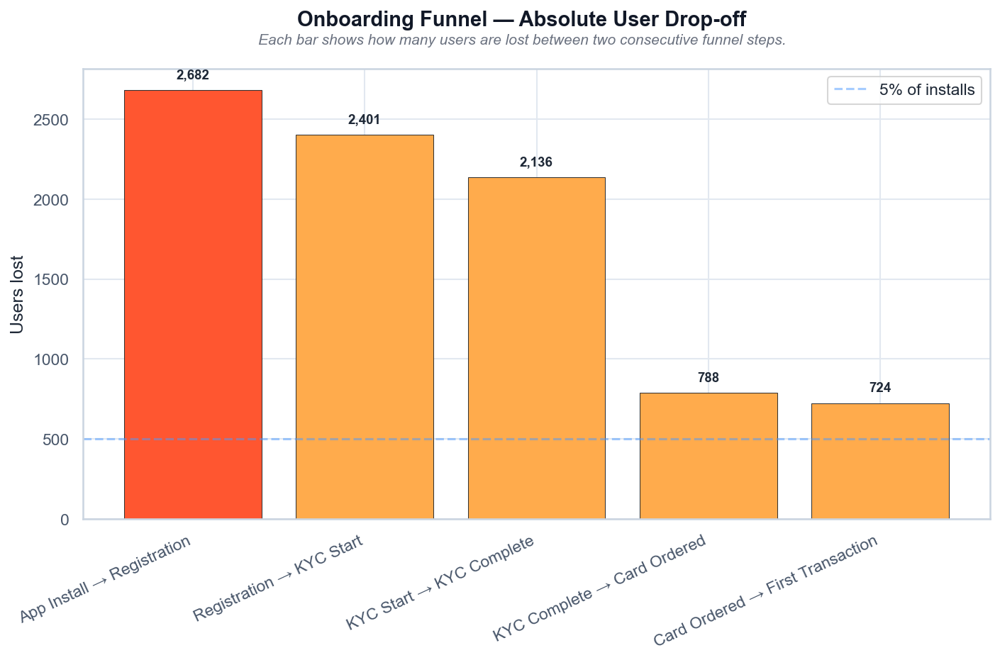

**A/B test** (Project 2)

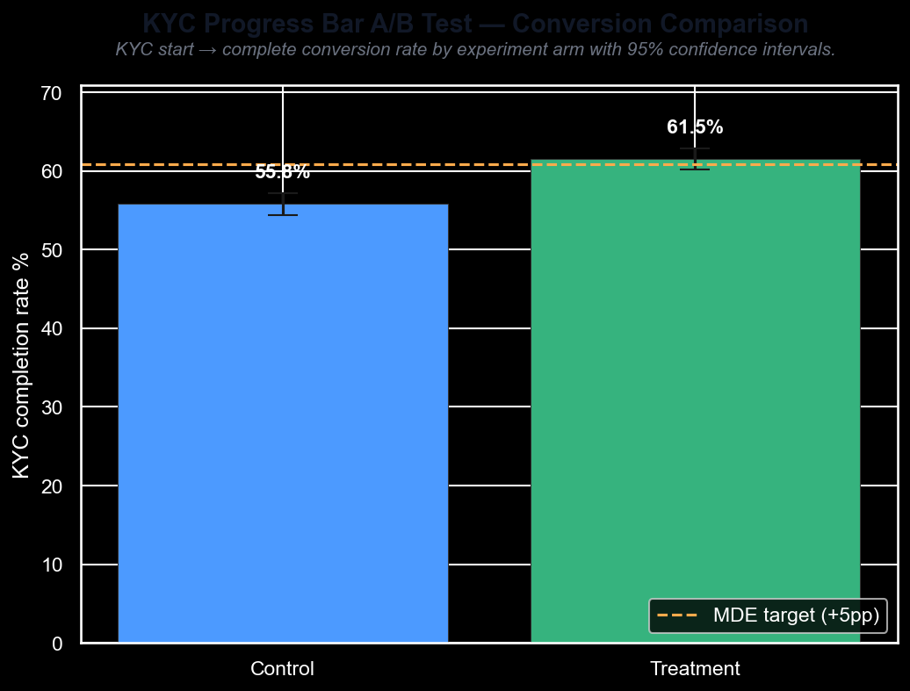

**Retention & cohorts** (Project 3)

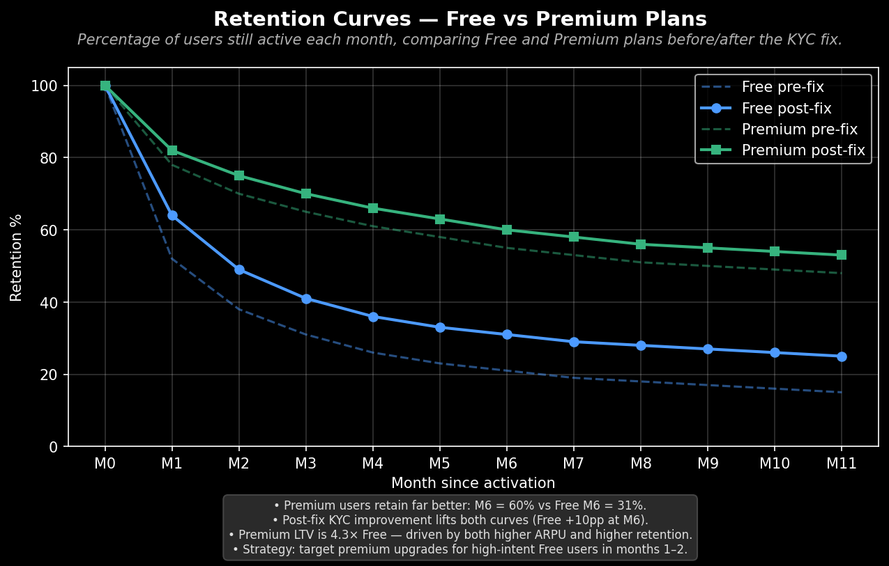

**Segmentation** (Project 4)

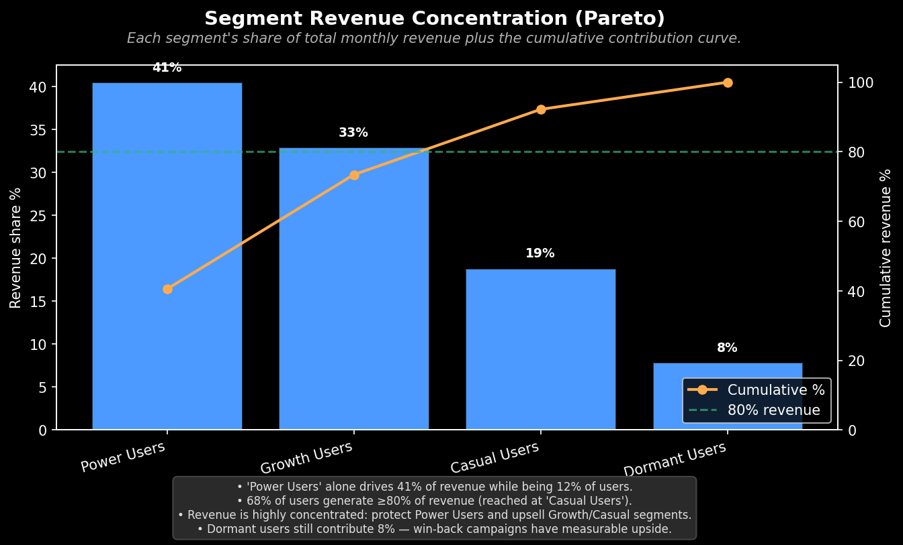

**Churn drivers** (Project 5)


**RFM segments** (Project 6)


**Traveler unit economics** (Project 14)
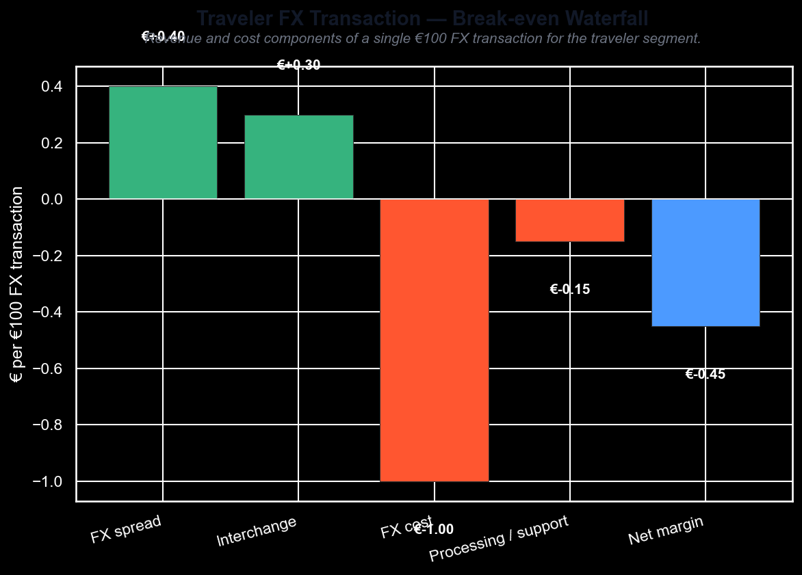

**Referral conversion by segment** (Project 17)
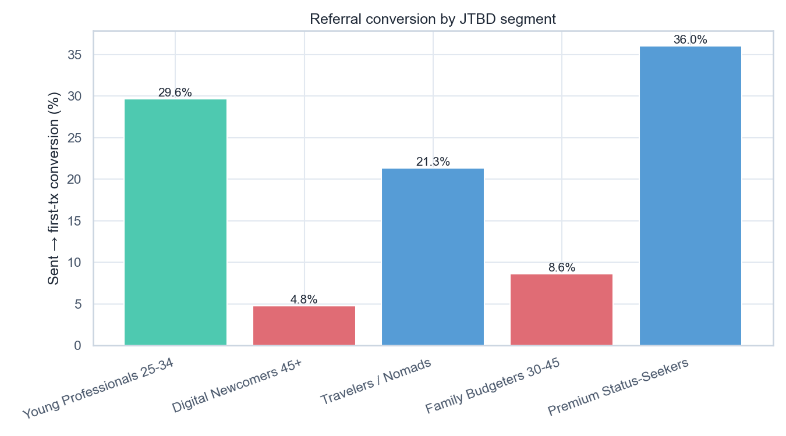

**Assisted-onboarding economics** (Project 18)

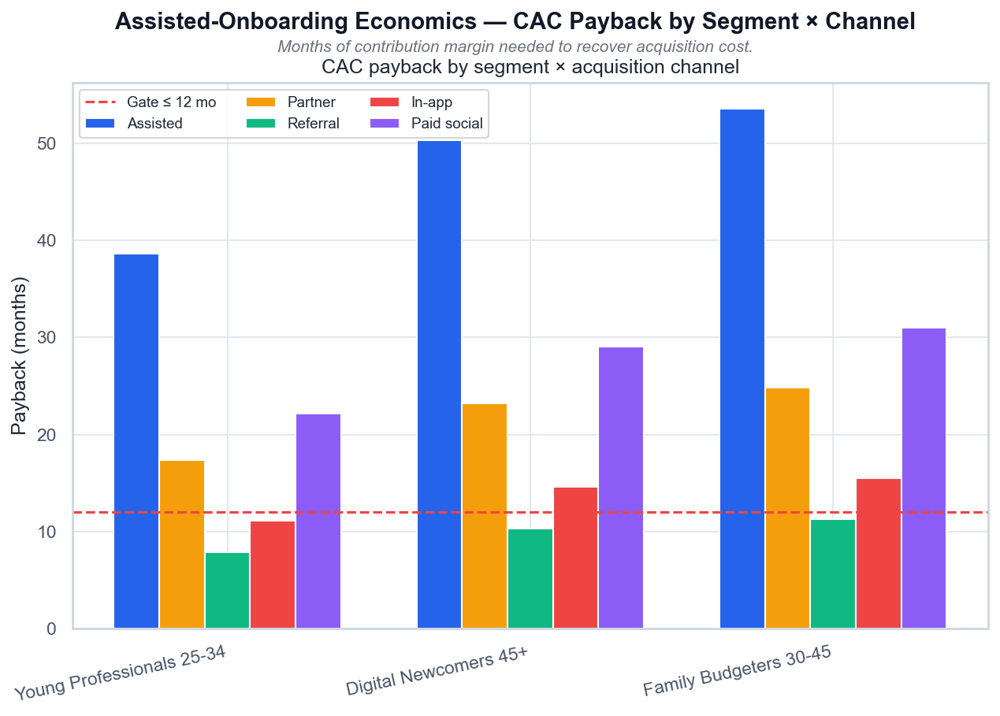

**FX sourcing feasibility** (Project 19)
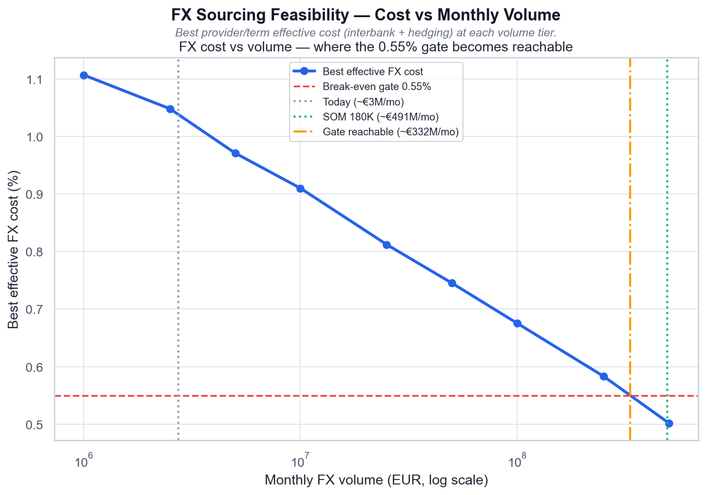
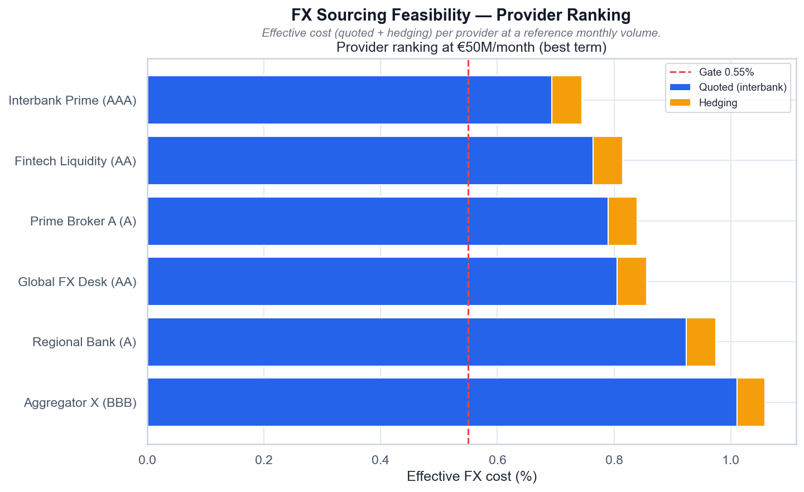

**Segment-specific premium offers** (Project 20)
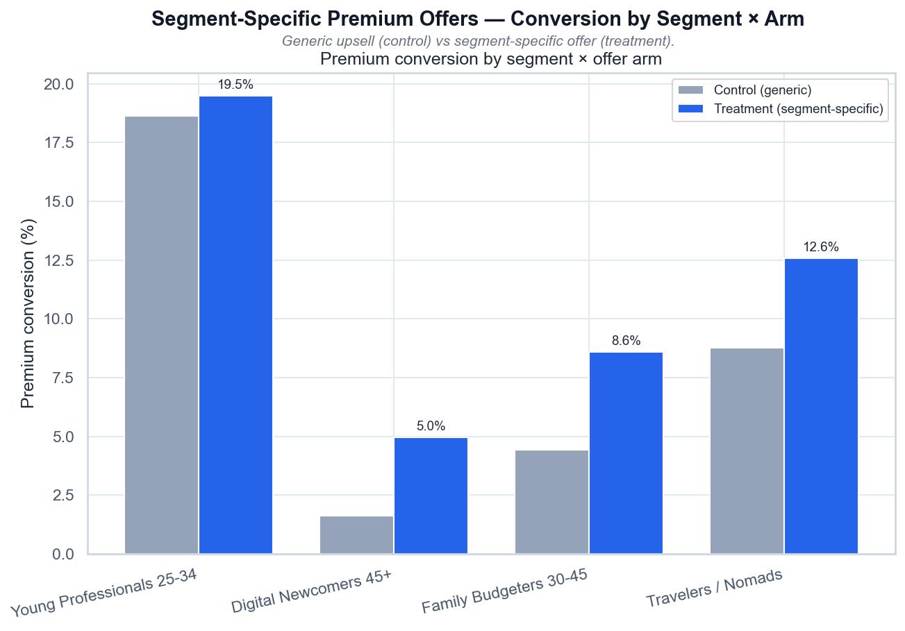
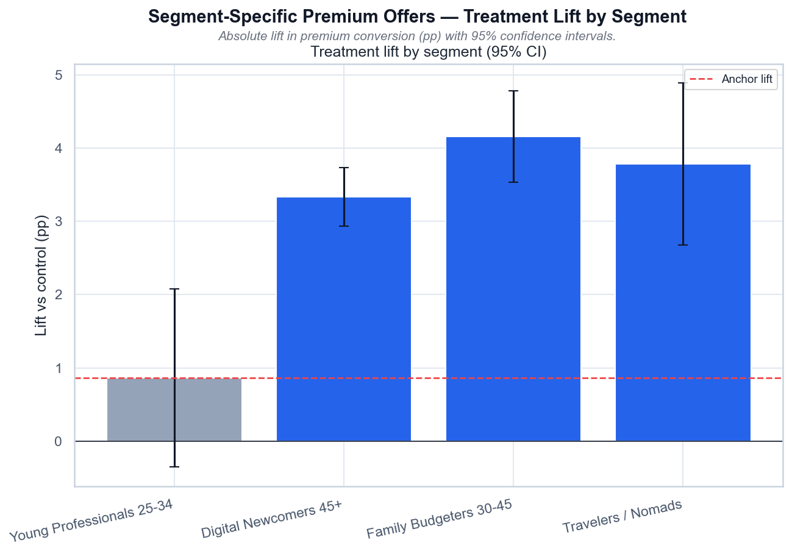

**Anchor launch CAC at scale** (Project 21)
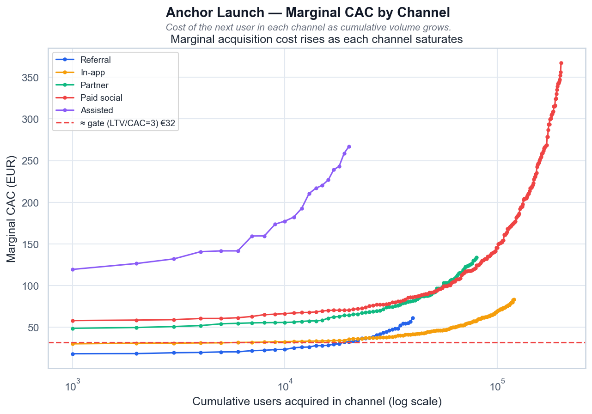
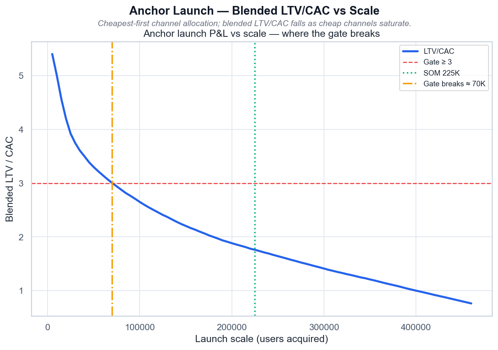

---

## 🛠️ Tech Stack

```
Python ≥3.10    pandas · numpy · matplotlib · seaborn · scipy · scikit-learn
uv              package manager (pyproject.toml + uv.lock)
ruff            lint + format (configured in pyproject.toml)
mypy            type checking (new code; legacy scripts exempted)
pytest          test suite (tests/) + pytest-cov (~97% on active code)
pre-commit      ruff + pytest hooks before each commit
nbformat/nbconvert   executed presentation notebooks
```

---

## 📁 Project Structure

```
volta-banking/
├── scripts/
│   ├── volta_funnel_analysis.py        Project 1 — funnel + Chi-square
│   ├── volta_ab_testing.py            Project 2 — A/B test + CUPED + AA-test
│   ├── volta_retention_analysis.py    Project 3 — cohort + LTV (Free vs Premium curves)
│   ├── volta_segmentation.py         Project 4 — K-means + PCA + monetization
│   ├── volta_churn_prediction.py     Project 5 — LR vs RF churn, ROC-AUC + importance
│   ├── volta_rfm_analysis.py         Project 6 — R/F/M scoring + lifecycle segments
│   ├── volta_clv_modeling.py         Project 7 — CLV: historical/retention/Gamma-Gamma
│   ├── volta_attribution.py          Project 8 — first/last/linear/Shapley attribution
│   ├── volta_anomaly_detection.py    Project 9 — Z-score/IQR/Isolation Forest
│   ├── volta_jtbd_mapping.py         Project 13 — JTBD segments × cohorts (risk #3)
│   ├── volta_unit_economics.py       Project 14 — traveler unit economics (risk #1)
│   ├── volta_premium_upsell.py       Project 15 — premium upsell transfer (risk #2)
│   ├── volta_kyc_deep_dive.py        Project 16 — 45+ KYC HTE + channels (risk #4)
│   ├── volta_referral_segments.py     Project 17 — referral by JTBD segment (risk #5)
│   ├── volta_assisted_cac.py         Project 18 — assisted CAC vs LTV (RAT v2 #1)
│   ├── volta_fx_sourcing.py          Project 19 — FX sourcing feasibility (RAT v2 #2)
│   ├── volta_premium_offers.py       Project 20 — segment premium offers A/B (RAT v2 #3)
│   ├── volta_anchor_cac.py           Project 21 — anchor launch CAC at scale (RAT v2 #4)
│   ├── generate_*.py                 seeded generators → data/*.csv (one per project)
│   └── build_notebooks.py             → executed notebooks/ for the core four projects
├── tests/                           pytest suite (+ smoke tests run every main())
├── utils/
│   ├── common.py                    shared setup, banners, CONSTANTS, data_path(), OUTPUT_DIR
│   ├── report_generator.py          Excel report generation (openpyxl)
│   └── pdf_processor.py             PDF table extraction (pdfplumber, pypdf)
├── data/                            all synthetic CSVs (committed)
├── outputs/                         generated PNG visualizations (committed)
├── notebooks/                       executed .ipynb for Projects 1–4
├── presentations/                   PRD docs, slide decks, executive summary HTML
├── pyproject.toml                   deps + ruff/mypy/pytest/cov config
├── uv.lock
├── Makefile                         task runner: make data|test|lint|format|type|notebooks|all
└── .gitignore
```

---

## 🚀 Quickstart

```bash
# 1. Install dependencies (dev group includes ruff + pytest)
uv sync --all-groups

# 2. Generate the synthetic datasets (seeded — reproducible)
make data
# or: PYTHONPATH=.:scripts uv run python scripts/generate_ab_data.py \
#     && PYTHONPATH=.:scripts uv run python scripts/generate_retention_data.py \
#     && PYTHONPATH=.:scripts uv run python scripts/generate_segmentation_data.py \
#     && PYTHONPATH=.:scripts uv run python scripts/generate_funnel_data.py

# 3. Run the four analyses in order
PYTHONPATH=.:scripts uv run python scripts/volta_funnel_analysis.py
PYTHONPATH=.:scripts uv run python scripts/volta_ab_testing.py
PYTHONPATH=.:scripts uv run python scripts/volta_retention_analysis.py
PYTHONPATH=.:scripts uv run python scripts/volta_segmentation.py

# 4. Lint / format / type
uv run ruff check .
uv run ruff format .
uv run mypy

# 5. Run the test suite (with coverage)
uv run pytest
```

> All four projects read CSVs produced by the generators into `data/` (the funnel
> CSV is committed there too). PNG visualizations land in `outputs/`. Re-run
> `make data` anytime — the generators are seeded and deterministic.

---

## 📐 Methodology

- **Funnel** — step conversion, absolute/relative drop-off, Chi-square channel test,
  Wilson confidence intervals on step conversion rates
- **A/B testing** — sample-size calc, SRM check, bootstrap CI, Bonferroni/Holm/BH
  multiple-testing correction, AA-test under H₀, CUPED variance reduction
  (control-only θ, % variance reduction reported), sensitivity at MDE
  (not deprecated post-hoc power)
- **Retention** — cohort curves, pre/post Welch t-test + Cohen's d, bootstrap CIs on
  M1/M3/M6 retention, plan-specific LTV curves with ARPU × retention decomposition
- **Segmentation** — StandardScaler + KMeans, data-driven K (marginal-gain elbow,
  silhouette validation), per-cluster silhouette, PCA projection, Lorenz
  concentration, churn sensitivity
- **JTBD × Cohorts** — cross-tab JTBD segment × behavioral cohort, chi-square test
  of independence, two-proportion z-test on Dormant share (Digital Newcomers 45+
  vs Family Budgeters), UX-friction contrast (support tickets, KYC duration)
- **Unit Economics** — per-segment revenue/cost/margin per transaction, FX
  break-even (cost vs spread), one-at-a-time sensitivity of blended margin,
  scale projection at SOM
- **Premium Upsell** — Free→Premium conversion by JTBD segment and cohort,
  chi-square + two-proportion z-test (anchor vs gap segment), logistic-regression
  driver importance, offer-channel effect, top upgrade reason per segment
- **45+ KYC Deep-Dive** — HTE cut of the KYC A/B by age group (two-proportion
  z-test per age), KYC completion 45+ vs 25-34 by channel, chi-square age ×
  completion within treatment
- **Referral Segments** — referral funnel (sent→accepted→KYC→first-tx) by JTBD
  segment, chi-square segment × status, two-proportion z-test anchor vs gap,
  channel effect within gap segments
- **Assisted CAC vs LTV** — per-user LTV (ARPU × contribution margin × months
  retained), blended CAC by segment × channel, LTV/CAC with bootstrap CI,
  CAC payback in months, Welch t-test anchor vs 45+ on assisted LTV
- **FX Sourcing** — liquidity-provider quotes, best effective cost vs monthly
  volume (log-linear), required volume for the break-even gate (log-interpolated),
  provider ranking (quoted vs hedging split), hedging-term effect
- **Segment Premium Offers** — randomized A/B, sample-size/SRM checks,
  per-segment two-proportion z-test with 95% CI, Holm multiple-testing
  correction, segment × arm interaction (DiD z-test), residual-gap analysis,
  business impact on premium ARPU
- **Anchor Launch CAC** — marginal-CAC curves per channel (saturation), greedy
  cheapest-first allocation, blended LTV/CAC and payback vs launch scale,
  break-even scale, channel-mix and capacity analysis

All scripts use a shared `utils/common.py` (`setup()`, `print_section()`,
`CONSTANTS`, `data_path()`) and follow a `functions + main()` structure —
importing a module does **not** execute the analysis.

---

## 💡 Recommendations (Project 1)

1. **Redesign KYC UX** — progress bar (validated in Project 2), real-time photo guidance
2. **Simplify Registration** — A/B test removing phone-number field
3. **Double down on Referral** — launch referral bonus, reallocate 15% paid-social budget
4. **Android-specific sprint** — QA audit to close the iOS gap
5. **First-transaction nudge** — push + cashback on card activation

---

*Synthetic data · educational portfolio · seeded generators for reproducibility.*
