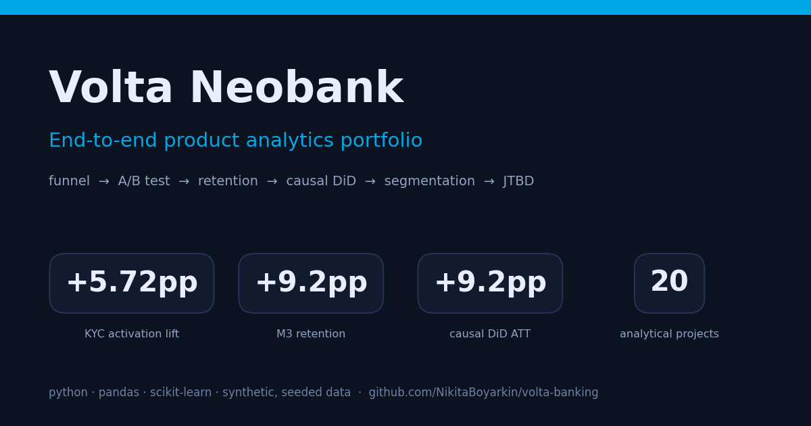

# Volta Neobank — продуктовая аналитика

[](https://github.com/NikitaBoyarkin/volta-banking/actions/workflows/ci.yml)


[](LICENSE)

**▶ [Открыть аналитический борд](docs/board/volta_board.html)** — открывается в браузере, без установки, сборки и CDN · **[PRD v2](docs/prd-v2.md)** · [Быстрый старт](#быстрый-старт)



Двадцать два проекта ведут вымышленный необанк Volta от первой установки до
удержания. Сначала воронка онбординга вскрывает узкое место на KYC, потом
A/B-тест проверяет, что его правда чинят, а когортный retention и каузальный
тест difference-in-differences — что эффект выжил через месяцы. Дальше отток,
сегментация, слой Market & Jobs и слой RAT v2, который считает в деньгах
собственные рекомендации портфолио.

Все данные синтетические, генераторы seeded и лежат в репозитории — любое
число ниже можно пересобрать одной командой.

---

## Главное

**KYC — узкое место онбординга.** Из 10 000 установок до первой транзакции
доходят 1 269 человек, а шаг KYC Complete теряет 43,4%. Прогресс-бар в
A/B-тесте поднял конверсию на **5,72 п.п.** (p < 0,0001, доверительный
интервал не пересекает ноль) — гейт выката пройден, эффект на портфель
**+€656K в год** при 44× ROI на €15K разработки.

**Эффект выжил в когортах.** M1 retention вырос на 11,8 п.п., M3 — на 9,2 п.п.,
инкрементальный LTV портфеля **+€227K в год**. Premium удерживаются лучше Free:
LTV в 4,3× выше, и это не артефакт только по ARPU — у Premium своя кривая
удержания, M6 ≈ 0,55 против 0,21.

**Выручка сконцентрирована.** 12% пользователей (Power) дают 41% выручки,
68% — 92%. Число сегментов выбрано из данных, а не назначено: elbow-правило
плюс валидация силуэтом дали K=4.

**Путешественники теряют деньги.** Минус €0,45 на каждые €100 FX-операции.
Безубыточность требует опустить FX-cost с 1,0% до 0,55%, а такая цена
доступна только на объёме ~€332 млн в месяц — это в 122 раза больше текущего.

**Правки не переносятся на новые сегменты.** Premium-апселл: якорь 17% против
цифровых новичков 45+ 2%. Реферал: 29,6% против 4,8%. Фикс KYC дал 35–44
годам +11,0 п.п., а 45+ — только +1,4 п.п. (p = 0,59). Барьер 45+ — доверие,
а не интерфейс.

**Но сегментный оффер работает.** Свой оффер вместо общего поднял конверсию
на 3,33 п.п. у 45+, на 4,16 п.п. у семейных бюджетов, на 3,79 п.п. у
путешественников — все значимы после поправки Holm. Разрыв сузился, но не
закрылся: generic-оффер якоря всё ещё втрое сильнее.

---

## Решения и гейты

Что делать с этими числами — и при каком условии решение пересматривается.

| Инициатива | Доказательство | Гейт | Решение |
|---|---|---|---|
| Прогресс-бар KYC | +5,72 п.п., p < 0,0001 | p < 0,05, лифт ≥ MDE, нет SRM | **Выкатить** на 100% |
| Сегментные premium-офферы | +3,3…+4,2 п.п. после Holm | лифт > 0 после поправки | **Выкатить**, помня про остаточный разрыв |
| Light-touch win-back 30–90 дней | ROI 2,54 (30–60 дн), 1,26 (60–90 дн) | ROI ≥ 1 | **Выкатить** узко |
| Trust-трек 45+ | LTV/CAC 0,66, payback 50 мес | LTV/CAC ≥ 3, payback ≤ 12 мес | **Придержать** — снижать CAC |
| Масштабирование тревел-сегмента | маржа < 0, гейт €332 млн/мес | FX-cost ≤ 0,55% | **Придержать** — пилот на 10% сегмента |
| Запуск якоря до SOM | LTV/CAC 1,76 на SOM | LTV/CAC ≥ 3 | **Придержать** — планировать до 70K |
| Human-звонок win-back | ROI 0,40 | ROI ≥ 1 | **Убрать** как массовый канал |

---

## Быстрый старт

```bash
# зависимости: dev-группа несёт ruff, mypy и pytest
uv sync --all-groups

# синтетические датасеты — seeded, воспроизводимо
make data

# тесты, линт и типы разом
make all

# или один анализ, из корня репозитория
PYTHONPATH=.:scripts uv run python scripts/volta_funnel_analysis.py
```

`make data` прогоняет генераторы и перезаписывает `data/`, PNG попадают в
`outputs/`. Отдельные цели: `make test`, `make lint`, `make type`,
`make notebooks`, `make board`.

---

## Стек и структура

| Слой | Чем сделан |
|---|---|
| Данные | pandas, numpy |
| Статистика и ML | scipy, scikit-learn, shap |
| Визуализация | matplotlib, seaborn |
| Отчёты | openpyxl, pdfplumber, pypdf |
| Инструменты | uv, ruff, mypy, pytest, pre-commit |

```
volta-banking/
├── scripts/    анализы volta_*.py и seeded-генераторы данных
├── tests/      pytest: unit-тесты и smoke на каждый main()
├── utils/      общие хелперы — setup, print_section, data_path
├── data/       синтетические CSV, лежат в репозитории
├── outputs/    PNG-визуализации, лежат в репозитории
├── notebooks/  исполненные ноутбуки проектов 1–4
├── docs/       PRD, ADR и HTML-борд
└── Makefile    data | test | lint | format | type | board | all
```

Каждый `volta_*.py` устроен как «функции + `main()`»: импорт модуля не
запускает анализ. Общие константы и хелперы живут в `utils/common.py`, чтобы
скрипты не разъезжались в допущениях.

<details>
<summary>Методология — что именно считается</summary>

- **Воронка** — пошаговая конверсия, абсолютный и относительный провал,
  хи-квадрат по каналам, интервалы Уилсона на конверсию шагов.
- **A/B** — размер выборки, проверка SRM, bootstrap-ДИ, поправки
  Бонферрони/Holm/BH, AA-тест под H₀, снижение дисперсии CUPED,
  чувствительность на MDE вместо устаревшей пост-хок мощности.
- **Retention** — когортные кривые, pre/post Welch-тест с Cohen's d,
  bootstrap-ДИ, разложение LTV на ARPU × удержание.
- **Сегментация** — StandardScaler + KMeans, K из данных, силуэт по кластерам,
  PCA-проекция, концентрация по Лоренцу, чувствительность к оттоку.
- **Причинность** — difference-in-differences, HTE по подгруппам с поправкой
  Holm, рандомизированные A/B на сегментных офферах и win-back.
- **Деньги** — LTV на пользователя, blended CAC по сегменту и каналу,
  LTV/CAC с bootstrap-ДИ, payback в месяцах, безубыточный объём, ROI на
  10 000 обработанных.

</details>

---

## Где читать дальше

- **[Аналитический борд](docs/board/volta_board.html)** — все 22 проекта на одной
  странице, без установки.
- **[PRD v2](docs/prd-v2.md)** — что входило в ограниченное переоткрытие
  портфолио. Запись о решении: [ADR 0001](docs/adr/0001-bounded-reopen-volta-2.0.md).
- **`notebooks/`** — исполненные ноутбуки проектов 1–4 с выводами по шагам.
- **[`docs/portfolio-full.md`](docs/portfolio-full.md)** — полная версия README:
  таблицы по каждому из 22 проектов, RAT v1 и v2, методология по всем разделам.

---

*Синтетические данные · образовательное портфолио · seeded-генераторы для
воспроизводимости.*
