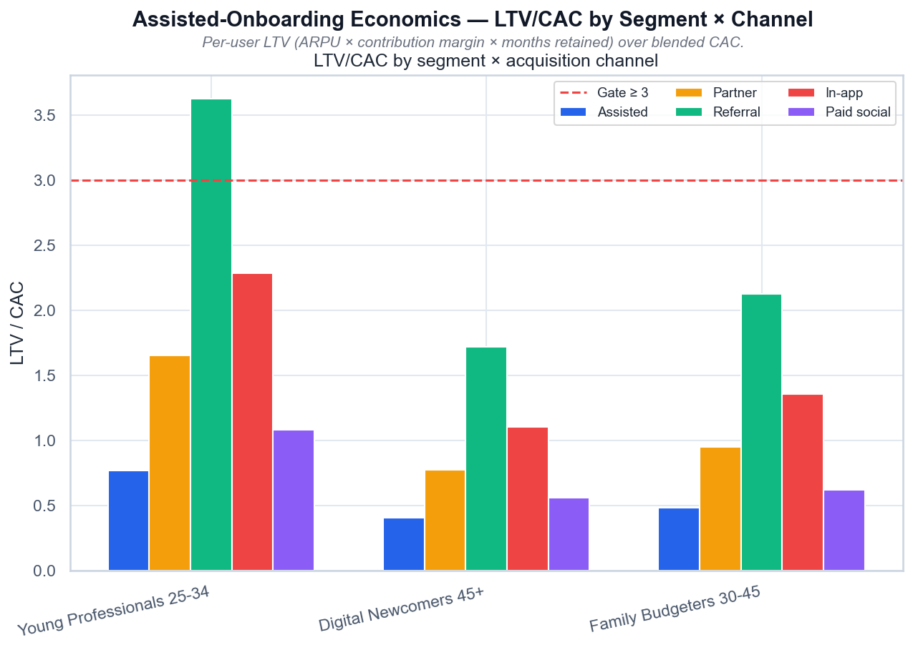

# Assisted-Onboarding Economics — LTV/CAC by Segment × Channel

*LTV/CAC по сегментам и каналам привлечения; красная линия — гейт ≥ 3,0.*

## Выводы

- Якорь (Young Professionals) проходит гейт только через реферал: LTV/CAC 3,62.
- 45+ (Digital Newcomers) не проходит гейт ни на одном канале: assisted 0,41 — в 3 раза ниже порога.
- Assisted-онбординг даёт лучший retention (churn ×0,75), но CAC €120 перекрывает этот выигрыш на 45+.
- Вывод: рекомендация «отдельный trust-трек для 45+» не окупается при текущем CAC — нужен более дешёвый доверительный канал.

---
Источник: `scripts/volta_assisted_cac.py` · данные: `data/volta_assisted_cac.csv`
