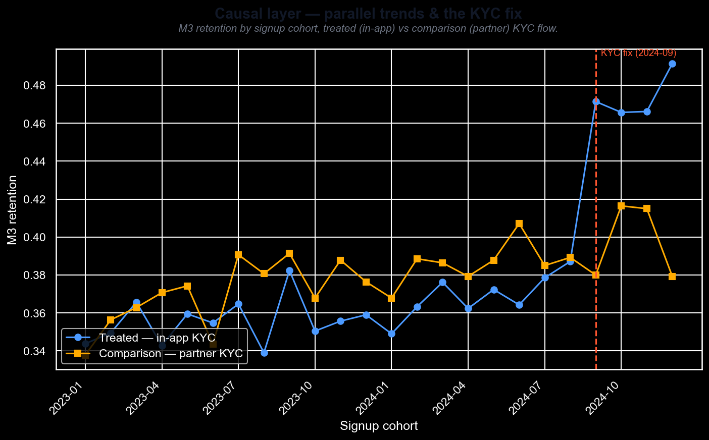

# Causal layer — parallel trends & the KYC fix

*M3-удержание по когортам регистрации: третируемый поток (in-app KYC) против сравнения (партнёрский KYC).*

## Выводы

- До изменения разрывы между группами стабильны → предпосылка о параллельных трендах правдоподобна.
- На точке 2024-09 у третируемого потока происходит скачок, у сравнения — нет.
- DiD-оценка изолирует этот скачок от общего месячного дрейфа.
- Данные синтетические: генератор закладывает истинный эффект, поэтому это проверка метода.

---
Источник: `scripts/volta_causal_kyc.py` · данные: `data/volta_causal_kyc.csv`
