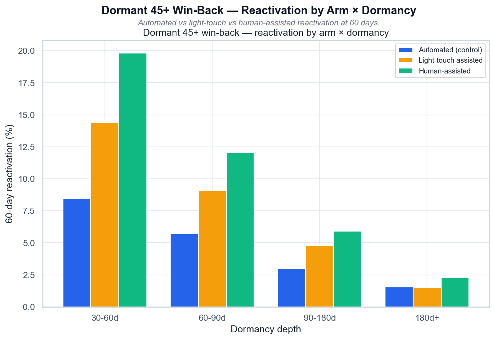

# Dormant 45+ Win-Back — Reactivation by Arm × Dormancy

*Реактивация (60 дней) по arm × глубине дормантности: автоматический vs light-touch vs human.*

## Выводы

- Assisted-реактивация: human даёт +11.4 п.п. (p=0.00e+00) на 30–60 днях против control.
- Эффект падает с глубиной дормантности: на 180d+ +0.7 п.п. против +11.4 п.п. на 30–60d.
- Light-touch даёт 52% эффекта human (overall) за долю цены.
- Дормантность 45+ — реально UX-барьер: у человека+упрощённого флоу возврат растёт.

---
Источник: `scripts/volta_dormant_winback.py` · данные: `data/volta_dormant_winback.csv`
