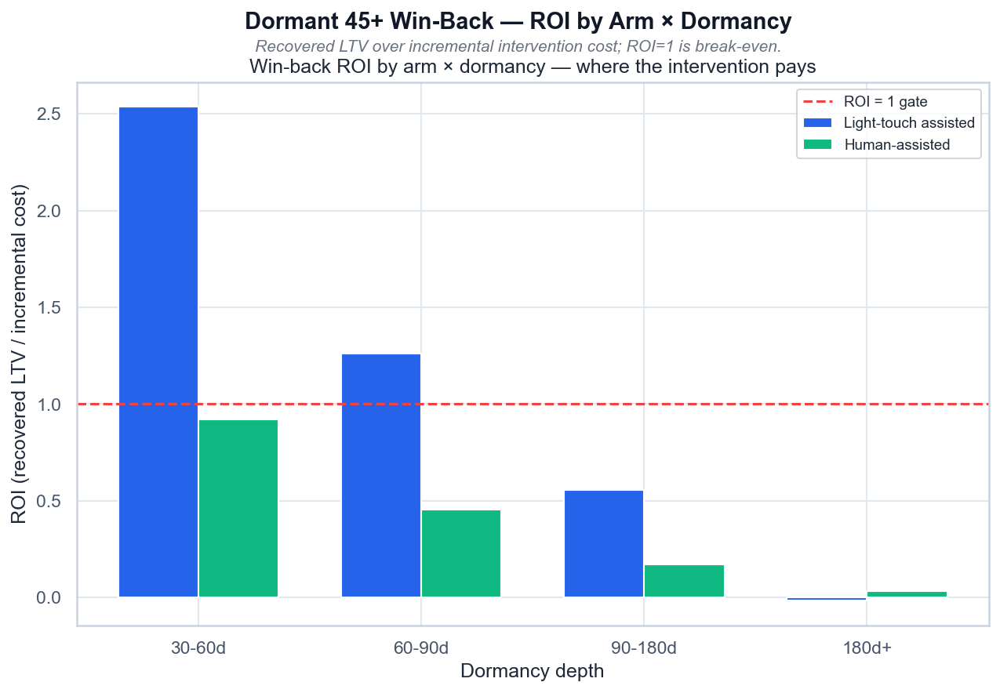

# Dormant 45+ Win-Back — ROI by Arm × Dormancy

*ROI (восстановленный LTV / прирост затрат) по arm × глубине дормантности; ROI=1 — окупаемость.*

## Выводы

- Human-звонок не окупается ни на одной глубине (ROI < 1) — €11 на юзера слишком дорого.
- Light-touch окупается на 30–60d (ROI 2,5) и 60–90d (ROI 1,3), дальше — нет.
- Целевой трек: light-touch только на 30–90 дней; глубже — не тратить.
- Human — только как эскалация для high-value/high-balance юзеров.

---
Источник: `scripts/volta_dormant_winback.py` · данные: `data/volta_dormant_winback.csv`
