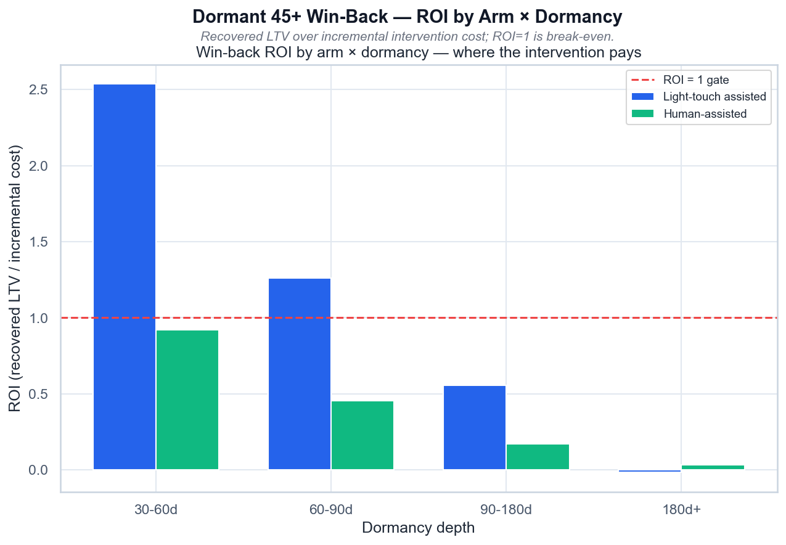

# Dormant 45+ Win-Back — ROI by Arm × Dormancy

*ROI (восстановленный LTV / прирост затрат) по arm × глубине дормантности; ROI=1 — окупаемость.*

## Выводы

- Human-звонок не окупается ни на одной глубине (max ROI 0.92 < 1) — €11 на юзера слишком дорого.
- Light-touch окупается на: 30-60d (ROI 2.54), 60-90d (ROI 1.26); на остальных глубинах — нет.
- Целевой трек: light-touch только на 30-60d, 60-90d; глубже — не тратить.
- Human — только как эскалация для high-value/high-balance юзеров.

---
Источник: `scripts/volta_dormant_winback.py` · данные: `data/volta_dormant_winback.csv`
