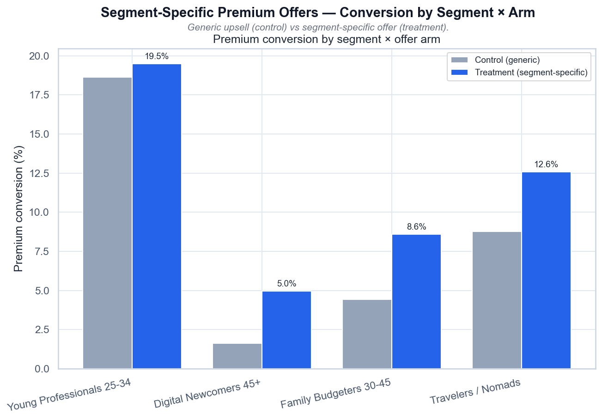

# Segment-Specific Premium Offers — Conversion by Segment × Arm

*Конверсия в Premium: generic-апселл (control) vs сегментный оффер (treatment).*

## Выводы

- Сегментные офферы поднимают конверсию в 3/3 gap-сегментах, но treatment не дотягивает до якоря.
- Якорь: lift +0.9 п.п. (p=0.16) — в пределах шума; его уже обслуживает generic-оффер.
- Остаточный разрыв: 45+ treatment (5.0%) всё ещё в 3.8 раза ниже control якоря (18.6%).
- Вывод: фикс работает, но закрывает разрыв лишь частично.

---
Источник: `scripts/volta_premium_offers.py` · данные: `data/volta_premium_offers.csv`
