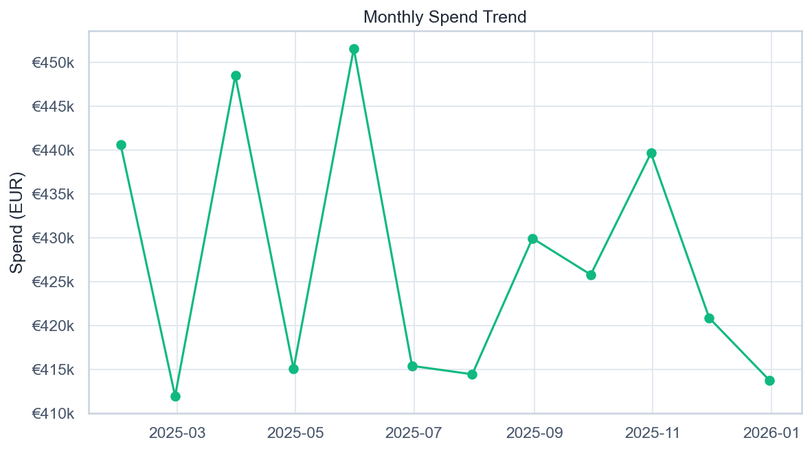

# Monthly Spend Trend

*Помесячный объём трат по завершённым транзакциям.*

## Выводы

- Пик трат — 2025-05 (€451 552).
- С 2025-01 по 2025-12 месячный объём изменился на -6,1%.
- Средний месячный объём — €427 267.
- Колебания держатся в коридоре €411 934–€451 552 (±6% от среднего): выраженной сезонности нет, ноябрь–декабрь — локальное снижение.

---
Источник: `scripts/volta_spend_analysis.py` · данные: `data/volta_transactions.csv`
